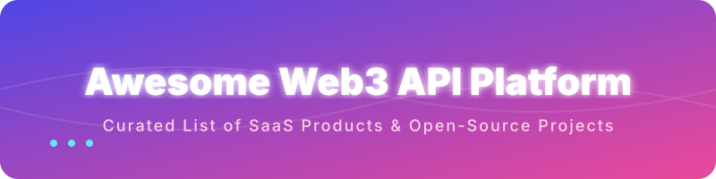

# Awesome-Web3-API-Platform

  

  
  
  

# 🚀 Awesome Web3 API Platform 🌐

## 🔧 Top Web3 API Platform Tools Ecosystem
**Curated List of SaaS Products & Open-Source GitHub Projects**
*Focused on Blockchain RPC, Node Infrastructure, Indexing, NFT & Wallet APIs, On-Chain Data & Developer Tooling*
**Last updated: August 2026**

This repository tracks notable **SaaS platforms** and **open-source projects** for **Web3 API Platforms**. These tools provide developers with reliable access to blockchain data via RPC nodes, enhanced APIs (balances, NFTs, transactions, tokens), real-time streams, indexing, and higher-level abstractions so teams can build dApps without running their own full nodes or indexers from scratch.

**Examples** include Moralis, Tatum, Thirdweb, Alchemy, QuickNode, Infura, Covalent, Bitquery, Chainbase, and Sequence (the category leaders and widely used platforms).

**Open-source emphasis**: The Web3 stack has a rich open-source foundation. This section prioritizes self-hostable node clients, decentralized indexing protocols, modern indexing frameworks, and open data APIs that give teams full control over infrastructure and data pipelines.

Contributions welcome! Open a PR to add/update entries. Keep descriptions factual and link to official sites / GitHub repos.

## 📑 Table of Contents
- [SaaS/Hosted Platforms](#saas-hosted-platforms)
- [Open-Source GitHub Projects](#open-source-github-projects)
- [How to Contribute](#how-to-contribute)
- [Disclaimer](#disclaimer)

## 🏢 SaaS/Hosted Platforms

| Platform | Description | Pricing | Free Tier Limit | Valuation/Revenue |
| :--- | :--- | :--- | :--- | :--- |
| **[Alchemy](https://www.alchemy.com/)** | Leading blockchain developer platform providing high-performance RPC, enhanced APIs, webhooks, smart wallets, and developer tooling across major chains. | Starts at $49/month | 30 million Compute Units (CUs) per month | $10.2B |
| **[Infura](https://www.infura.io/)** | Mature Ethereum-centric (and multi-chain) API and node infrastructure service widely used for RPC access and IPFS. | Starts at $50/month | 3,000,000 credits per day | $7B (Consensys) |
| **[QuickNode](https://www.quicknode.com/)** | High-performance multi-chain node infrastructure and API platform known for low latency, global coverage, and add-on data services. | Starts at $49/month | 10 million API responses per month | $800M |
| **[Sequence](https://sequence.xyz/)** | Developer platform focused on smart wallets, relayers, indexers, and infrastructure for consumer-facing onchain apps. | Pay as you go (starts $0/month) | 1,000 monthly active users (MAU) | $330M |
| **[Moralis](https://moralis.io/)** | Web3 development platform offering cross-chain APIs for NFTs, tokens, wallets, streams, and authentication — popular for rapid prototyping and production dApps. | Starts at $49/month | 40,000 Compute Units (CU) per day | $215M |
| **[Thirdweb](https://thirdweb.com/)** | Full-stack Web3 development framework and platform with SDKs, contracts, wallets, and infrastructure for building onchain applications. | Starts at $99/month | 50GB storage pinning | $160M |
| **[Tatum](https://tatum.io/)** | Multi-chain blockchain development platform with APIs for wallets, transactions, NFTs, and enterprise-grade infrastructure. | Starts at $25/month | 1,000,000 credits per month | $40M |
| **[Covalent](https://www.covalenthq.com/)** | Unified multi-chain blockchain data API focused on normalized balances, transactions, NFTs, and historical data. | Starts at $50/month | 25,000 API credits per month | ~$30M |
| **[Bitquery](https://bitquery.io/)** | Blockchain data platform offering GraphQL and streaming APIs for deep on-chain analytics across many networks. | Starts at $49/month | 10,000 API points free trial (1 month) or 7-day streaming trial | $20M |
| **[Chainbase](https://chainbase.com/)** | All-in-one Web3 data infrastructure platform providing indexed blockchain data and APIs for developers. | Starts at $99/month | 200,000 credits per month | $15M |

- **Additional infrastructure providers** (Ankr, Chainstack, NOWNodes, dRPC, etc.)  
  Broader ecosystem of node and API services frequently used alongside or instead of the platforms above.

## 💻 Open-Source GitHub Projects
- **[Supabase](https://github.com/supabase/supabase)**   
  The open source Firebase alternative. Great for building web3 app backends.
- **[Geth](https://github.com/ethereum/go-ethereum)**   
  Official Go Ethereum client
- **[Hasura](https://github.com/hasura/graphql-engine)**   
  Blazing fast, instant GraphQL APIs for your databases.
- **[PostgREST](https://github.com/PostgREST/postgrest)**   
  REST API for any Postgres database.
- **[The Graph](https://thegraph.com/)**   
  Decentralized indexing protocol. Developers write subgraphs to index smart-contract events and query them via GraphQL.
- **[Ceramic](https://github.com/ceramicnetwork/js-ceramic)**   
  Decentralized data network for building Web3 applications.
- **[OrbitDB](https://github.com/orbitdb/orbit-db)**   
  Peer-to-Peer Databases for the Decentralized Web.
- **[Reth](https://github.com/paradigmxyz/reth)**   
  Rust-based modular Ethereum execution client
- **[Blockscout](https://github.com/blockscout/blockscout)**   
  Open-source blockchain explorer that can be self-hosted and extended for transaction, token, and contract data APIs.
- **[Erigon](https://github.com/ledgerwatch/erigon)**   
  High-performance, archive-friendly Ethereum client
- **[Nethermind](https://github.com/NethermindEth/nethermind)**   
  .NET Ethereum client
- **[TrueBlocks](https://github.com/TrueBlocks/trueblocks-core)**   
  Local-first, open-source blockchain data tools emphasizing privacy, completeness, and self-hosted indexing of Ethereum and compatible chains.
- **[Envio](https://github.com/enviodev/hyperindex)**   
  Modern open-source (and hosted) blockchain indexer focused on speed, multichain support, and developer-friendly handlers.
- **[Ponder](https://github.com/ponder-sh/ponder)**   
  Open-source framework for indexing EVM blockchain data into a custom GraphQL API with excellent TypeScript developer experience.
- **[Subsquid / SQD](https://github.com/subsquid/squid-sdk)**   
  High-performance open-source indexing framework and data network for building custom blockchain indexers and APIs.

- **RPC Load Balancers & Node Tooling** (e.g., nodecore and similar projects)  
  Open-source tools for load-balancing, failover, and managing multiple upstream RPC endpoints.
- **Specialized Indexers**  
  Community projects for NFT indexing, music NFTs, DeFi events, and chain-specific data pipelines that can be self-hosted.

### ➕ Additional Strong Open-Source Options
- Light clients and alternative sync modes for reduced resource requirements.
- IPFS and decentralized storage gateways that complement on-chain data.
- Open wallet and account abstraction libraries that pair with self-hosted infrastructure.
- Benchmarking and monitoring tools for self-hosted nodes and indexers.
- Multi-chain data schemas and transformation libraries used across indexing frameworks.

**Frameworks for building custom systems**: Many teams run **self-hosted nodes** (Reth/Erigon/Geth) behind an open load balancer for RPC, then use **The Graph**, **Ponder**, **Subsquid**, or **Envio** for application-specific indexing. This combination replaces most commercial Web3 API needs while retaining full control and avoiding rate limits or vendor lock-in.

## 🤝 How to Contribute
1. Fork the repo.
2. Add/edit entries in `README.md` (follow existing format).
3. Include: name, link, 1–2 sentence description, and whether it's SaaS or open-source.
4. Submit PR with a short explanation.

Star the repo if you find it useful!

## ⚠️ Disclaimer
- This is a **community-curated** list — not exhaustive and not an endorsement.
- Web3 API platforms should be evaluated for chain coverage, latency, reliability, rate limits, data freshness, enhanced vs raw RPC capabilities, indexing flexibility, and total cost at scale.
- Self-hosting nodes and indexers provides maximum control and can be more cost-effective at high volume, but requires operational expertise, monitoring, storage, and ongoing maintenance. Always validate data accuracy and consider redundancy for production systems.
---
**Made for Web3 developers, protocol teams, and infrastructure engineers who want reliable on-chain data without unnecessary platform lock-in.**
Let's make blockchain access, indexing, and developer APIs more open, self-sovereign, and censorship-resistant.

## 📊 Star History

